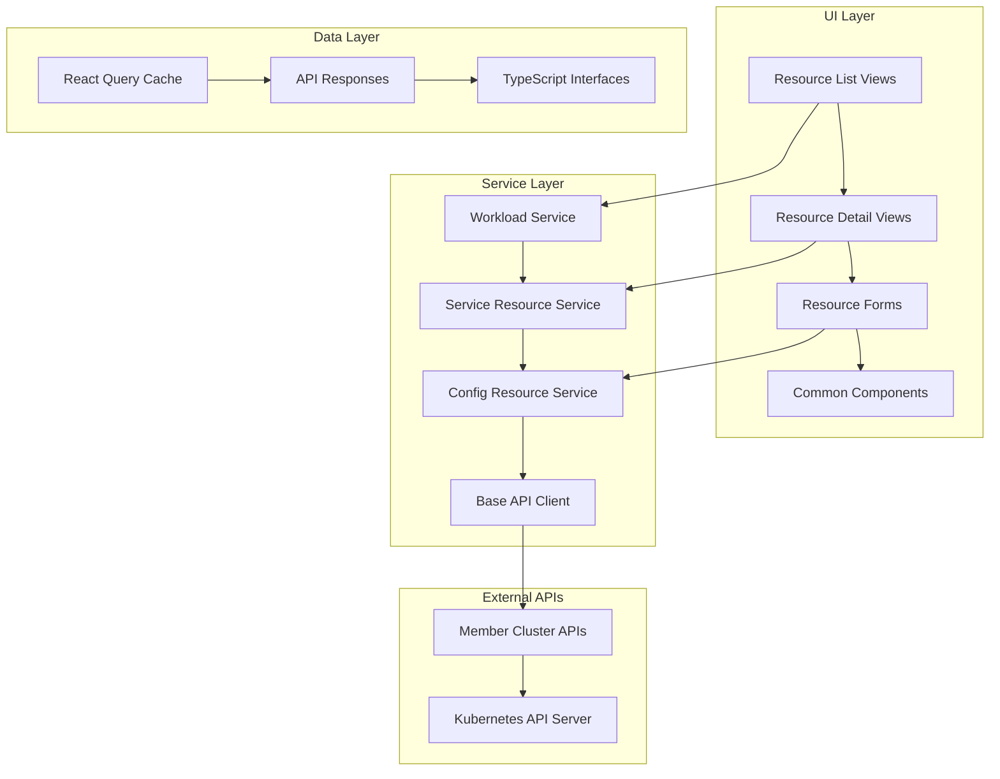
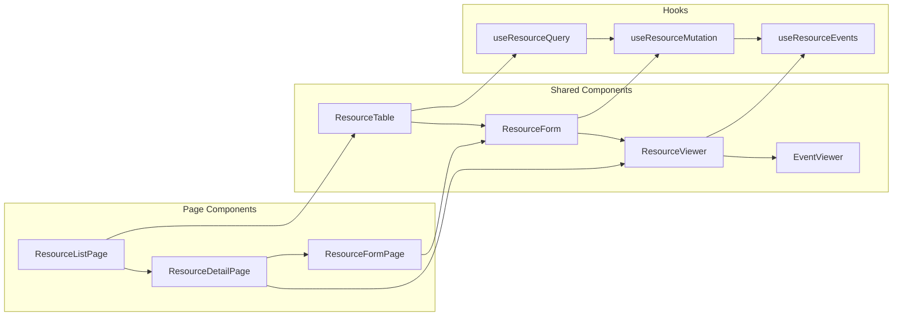

# Design Document: Member Cluster Resource Management

## Overview

This design document outlines the implementation of comprehensive member cluster resource management features for the Karmada Dashboard UI. The system will extend the existing workload service architecture to provide complete CRUD operations for all Kubernetes resource types including workloads, services, configuration resources, and storage resources.

The design follows established patterns from the existing codebase, utilizing React/TypeScript with Ant Design components, React Query for data fetching, and a consistent REST API pattern. The architecture emphasizes modularity, type safety, and user experience consistency across all resource types.

## Architecture

### High-Level Architecture



### Service Architecture Pattern

The design extends the existing service pattern established in `workload.ts`:

1. **Base Client**: `karmadaMemberClusterClient` for all API communications
2. **URL Pattern**: `/clusterapi/{memberClusterName}/api/v1/{resource}[/{namespace}[/{name}]]`
3. **Response Typing**: Consistent `IResponse<T>` wrapper with error handling
4. **Query Parameters**: `DataSelectQuery` for filtering, sorting, and pagination

### Component Architecture



## Components and Interfaces

### Core TypeScript Interfaces

#### Base Resource Interfaces

```typescript
// Extending existing base interfaces
export interface ResourceMeta extends ObjectMeta {
  resourceVersion: string;
  generation?: number;
  finalizers?: string[];
  ownerReferences?: OwnerReference[];
}

export interface OwnerReference {
  apiVersion: string;
  kind: string;
  name: string;
  uid: string;
  controller?: boolean;
  blockOwnerDeletion?: boolean;
}

export interface ResourceStatus {
  phase?: string;
  conditions?: Condition[];
  observedGeneration?: number;
}

export interface Condition {
  type: string;
  status: string;
  lastTransitionTime: string;
  reason?: string;
  message?: string;
}
```

#### Service Resource Interfaces

```typescript
export interface ServiceResource {
  objectMeta: ResourceMeta;
  typeMeta: TypeMeta;
  spec: ServiceSpec;
  status?: ServiceStatus;
}

export interface ServiceSpec {
  type: ServiceType;
  selector?: Record<string, string>;
  ports: ServicePort[];
  clusterIP?: string;
  externalIPs?: string[];
  loadBalancerIP?: string;
  sessionAffinity?: string;
}

export interface ServicePort {
  name?: string;
  protocol: string;
  port: number;
  targetPort: number | string;
  nodePort?: number;
}

export enum ServiceType {
  ClusterIP = 'ClusterIP',
  NodePort = 'NodePort',
  LoadBalancer = 'LoadBalancer',
  ExternalName = 'ExternalName'
}

export interface IngressResource {
  objectMeta: ResourceMeta;
  typeMeta: TypeMeta;
  spec: IngressSpec;
  status?: IngressStatus;
}

export interface IngressSpec {
  ingressClassName?: string;
  defaultBackend?: IngressBackend;
  tls?: IngressTLS[];
  rules: IngressRule[];
}

export interface IngressRule {
  host?: string;
  http: HTTPIngressRuleValue;
}

export interface HTTPIngressRuleValue {
  paths: HTTPIngressPath[];
}

export interface HTTPIngressPath {
  path?: string;
  pathType: string;
  backend: IngressBackend;
}

export interface IngressBackend {
  service?: IngressServiceBackend;
  resource?: TypedLocalObjectReference;
}
```

#### Configuration Resource Interfaces

```typescript
export interface ConfigMapResource {
  objectMeta: ResourceMeta;
  typeMeta: TypeMeta;
  data?: Record<string, string>;
  binaryData?: Record<string, string>;
  immutable?: boolean;
}

export interface SecretResource {
  objectMeta: ResourceMeta;
  typeMeta: TypeMeta;
  type: SecretType;
  data?: Record<string, string>;
  stringData?: Record<string, string>;
  immutable?: boolean;
}

export enum SecretType {
  Opaque = 'Opaque',
  ServiceAccountToken = 'kubernetes.io/service-account-token',
  DockerConfigJson = 'kubernetes.io/dockerconfigjson',
  BasicAuth = 'kubernetes.io/basic-auth',
  SSHAuth = 'kubernetes.io/ssh-auth',
  TLS = 'kubernetes.io/tls'
}

export interface PersistentVolumeClaimResource {
  objectMeta: ResourceMeta;
  typeMeta: TypeMeta;
  spec: PVCSpec;
  status?: PVCStatus;
}

export interface PVCSpec {
  accessModes: string[];
  resources: ResourceRequirements;
  storageClassName?: string;
  volumeMode?: string;
  selector?: LabelSelector;
}

export interface PVCStatus {
  phase: string;
  accessModes?: string[];
  capacity?: Record<string, string>;
  conditions?: Condition[];
}
```

## Correctness Properties

*A property is a characteristic or behavior that should hold true across all valid executions of a system—essentially, a formal statement about what the system should do. Properties serve as the bridge between human-readable specifications and machine-verifiable correctness guarantees.*

Based on the prework analysis and property reflection, the following properties validate the system's correctness:

### Property 1: Resource List Display Completeness
*For any* resource type and any set of resources, the list view should display all required fields specific to that resource type (name, namespace, status indicators, and resource-specific information like images for deployments, ports for services, data keys for configmaps)
**Validates: Requirements 1.1, 2.1, 2.2, 2.3, 2.4, 3.1, 3.3, 4.1, 4.3, 4.5**

### Property 2: Resource Detail View Completeness  
*For any* resource and its detail view, the display should contain all comprehensive information including metadata, specifications, status, and resource-specific details (pods for deployments, endpoints for services, key-value pairs for configmaps)
**Validates: Requirements 1.2, 3.2, 3.4, 4.2, 4.4, 4.6, 8.1**

### Property 3: Form Functionality and Validation
*For any* resource type, creating or editing should provide appropriate forms with resource-specific validation, templates, and proper field handling
**Validates: Requirements 1.3, 1.5, 2.6, 3.5, 3.6, 4.7, 9.1, 9.2, 9.3, 9.4, 9.5, 9.6, 9.7**

### Property 4: Deletion Workflow Consistency
*For any* resource type, deletion should show appropriate confirmation dialogs, handle cascading deletions, and provide warnings about dependent resources where applicable
**Validates: Requirements 1.4, 2.7, 3.7, 4.8**

### Property 5: UI Consistency Across Resource Types
*For any* resource type, the user interface should maintain consistent layout, navigation patterns, error handling, loading states, and feedback mechanisms
**Validates: Requirements 5.1, 5.2, 5.3, 5.4, 5.5, 5.6, 5.7**

### Property 6: Advanced List View Features
*For any* resource list, filtering, sorting, pagination, search, bulk operations, export, and refresh functionality should work consistently with appropriate loading indicators and user feedback
**Validates: Requirements 7.1, 7.2, 7.3, 7.4, 7.5, 7.6, 7.7**

### Property 7: Workload-Specific Operations
*For any* workload resource, workload-specific operations (pause/resume deployments, trigger cronjobs, view pods) should execute correctly and provide status feedback
**Validates: Requirements 1.7, 2.5**

### Property 8: Resource Relationships and Events
*For any* resource, viewing related resources, events, YAML, logs, metrics, and navigation between related resources should work correctly with proper filtering and chronological display
**Validates: Requirements 1.6, 8.2, 8.3, 8.4, 8.5, 8.6, 8.7, 10.1, 10.2, 10.3, 10.4, 10.5, 10.6, 10.7**

### Property 9: Error Handling Robustness
*For any* error condition (network errors, validation errors, 404s, authorization errors, unexpected errors, malformed responses), the system should handle them gracefully with appropriate user-friendly messages and recovery options
**Validates: Requirements 6.2, 6.3, 6.4, 6.5, 6.6, 6.7**

### Property 10: API Client Consistency
*For any* API operation, the client should use consistent URL patterns, response typing, CRUD operations, pagination parameters, caching strategies, authentication handling, and bulk operation support
**Validates: Requirements 11.1, 11.2, 11.3, 11.4, 11.5, 11.6, 11.7**

### Property 11: Resource Parsing and Serialization
*For any* resource parsing or serialization operation, the system should validate syntax, handle malformed data gracefully, provide descriptive error messages, maintain proper formatting, and validate against schemas
**Validates: Requirements 12.1, 12.2, 12.3, 12.5, 12.6, 12.7**

### Property 12: Resource Serialization Round-Trip
*For any* valid resource object, parsing then printing then parsing should produce an equivalent object (round-trip property)
**Validates: Requirements 12.4**

### Service Layer Components

#### Extended Workload Service

Building on the existing `workload.ts`, add missing CRUD operations:

```typescript
// Update operations for all workload types
export async function UpdateMemberClusterDeployment(params: {
  memberClusterName: string;
  namespace: string;
  name: string;
  content: string;
}) {
  const { memberClusterName, namespace, name, content } = params;
  const resp = await karmadaMemberClusterClient.put<IResponse<WorkloadDetail>>(
    `/clusterapi/${memberClusterName}/api/v1/deployment/${namespace}/${name}`,
    { content }
  );
  return resp.data;
}

export async function DeleteMemberClusterDeployment(params: {
  memberClusterName: string;
  namespace: string;
  name: string;
  gracePeriodSeconds?: number;
}) {
  const { memberClusterName, namespace, name, gracePeriodSeconds } = params;
  const resp = await karmadaMemberClusterClient.delete<IResponse<any>>(
    `/clusterapi/${memberClusterName}/api/v1/deployment/${namespace}/${name}`,
    { params: { gracePeriodSeconds } }
  );
  return resp.data;
}
```

#### New Service Resource Service

```typescript
// ui/apps/dashboard/src/services/member-cluster/service.ts
export async function GetMemberClusterServices(params: {
  memberClusterName: string;
  namespace?: string;
  keyword?: string;
  filterBy?: string[];
  sortBy?: string[];
  itemsPerPage?: number;
  page?: number;
}) {
  const { memberClusterName, namespace, keyword, ...queryParams } = params;
  const url = namespace
    ? `/clusterapi/${memberClusterName}/api/v1/service/${namespace}`
    : `/clusterapi/${memberClusterName}/api/v1/service`;
  
  const requestData = { ...queryParams } as DataSelectQuery;
  if (keyword) {
    requestData.filterBy = ['name', keyword];
  }
  
  const resp = await karmadaMemberClusterClient.get<
    IResponse<{
      errors: string[];
      listMeta: { totalItems: number };
      services: ServiceResource[];
    }>
  >(url, { params: convertDataSelectQuery(requestData) });
  return resp.data;
}

export async function GetMemberClusterServiceDetail(params: {
  memberClusterName: string;
  namespace: string;
  name: string;
}) {
  const { memberClusterName, namespace, name } = params;
  const resp = await karmadaMemberClusterClient.get<
    IResponse<ServiceResource & { endpoints?: Endpoint[] }>
  >(`/clusterapi/${memberClusterName}/api/v1/service/${namespace}/${name}`);
  return resp.data;
}
```

#### Configuration Resource Service

```typescript
// ui/apps/dashboard/src/services/member-cluster/config.ts
export async function GetMemberClusterConfigMaps(params: {
  memberClusterName: string;
  namespace?: string;
  keyword?: string;
  filterBy?: string[];
  sortBy?: string[];
  itemsPerPage?: number;
  page?: number;
}) {
  const { memberClusterName, namespace, keyword, ...queryParams } = params;
  const url = namespace
    ? `/clusterapi/${memberClusterName}/api/v1/configmap/${namespace}`
    : `/clusterapi/${memberClusterName}/api/v1/configmap`;
  
  const requestData = { ...queryParams } as DataSelectQuery;
  if (keyword) {
    requestData.filterBy = ['name', keyword];
  }
  
  const resp = await karmadaMemberClusterClient.get<
    IResponse<{
      errors: string[];
      listMeta: { totalItems: number };
      configMaps: ConfigMapResource[];
    }>
  >(url, { params: convertDataSelectQuery(requestData) });
  return resp.data;
}
```

### UI Component Architecture

#### Resource List Component Pattern

```typescript
// Common pattern for all resource list components
interface ResourceListProps<T> {
  memberClusterName: string;
  resourceType: string;
  columns: TableColumnProps<T>[];
  fetchFunction: (params: any) => Promise<any>;
  createPath?: string;
  bulkActions?: BulkAction[];
}

export function ResourceList<T extends { objectMeta: ResourceMeta }>({
  memberClusterName,
  resourceType,
  columns,
  fetchFunction,
  createPath,
  bulkActions
}: ResourceListProps<T>) {
  const [filter, setFilter] = useState<ResourceFilter>({
    selectedNamespace: '',
    searchText: '',
    selectedLabels: [],
    sortBy: [],
    page: 1,
    itemsPerPage: 10
  });

  const { data, isLoading, error } = useQuery({
    queryKey: [memberClusterName, resourceType, JSON.stringify(filter)],
    queryFn: () => fetchFunction({ memberClusterName, ...filter })
  });

  // Common table implementation with consistent patterns
  return (
    <div className="resource-list">
      <ResourceListHeader 
        resourceType={resourceType}
        filter={filter}
        onFilterChange={setFilter}
        createPath={createPath}
      />
      <ResourceTable
        columns={columns}
        dataSource={data?.items || []}
        loading={isLoading}
        pagination={{
          current: filter.page,
          pageSize: filter.itemsPerPage,
          total: data?.listMeta?.totalItems || 0,
          onChange: (page, pageSize) => setFilter(prev => ({ ...prev, page, itemsPerPage: pageSize }))
        }}
        rowSelection={bulkActions ? {
          onChange: handleBulkSelection
        } : undefined}
      />
      {bulkActions && (
        <BulkActionBar actions={bulkActions} selectedItems={selectedItems} />
      )}
    </div>
  );
}
```

#### Resource Detail Component Pattern

```typescript
interface ResourceDetailProps {
  memberClusterName: string;
  namespace: string;
  name: string;
  resourceType: string;
  fetchFunction: (params: any) => Promise<any>;
  tabs?: DetailTab[];
}

export function ResourceDetail({
  memberClusterName,
  namespace,
  name,
  resourceType,
  fetchFunction,
  tabs = []
}: ResourceDetailProps) {
  const { data, isLoading } = useQuery({
    queryKey: [memberClusterName, resourceType, namespace, name],
    queryFn: () => fetchFunction({ memberClusterName, namespace, name })
  });

  const defaultTabs: DetailTab[] = [
    { key: 'overview', label: 'Overview', component: ResourceOverview },
    { key: 'yaml', label: 'YAML', component: ResourceYAML },
    { key: 'events', label: 'Events', component: ResourceEvents },
    ...tabs
  ];

  return (
    <div className="resource-detail">
      <ResourceDetailHeader resource={data} />
      <Tabs items={defaultTabs.map(tab => ({
        key: tab.key,
        label: tab.label,
        children: <tab.component resource={data} memberClusterName={memberClusterName} />
      }))} />
    </div>
  );
}
```

## Data Models

### Resource State Management

```typescript
// Resource query hooks pattern
export function useResourceQuery<T>(
  memberClusterName: string,
  resourceType: string,
  params: ResourceQueryParams
) {
  return useQuery({
    queryKey: [memberClusterName, resourceType, params],
    queryFn: () => getResourceFunction(params),
    staleTime: 30000, // 30 seconds
    refetchInterval: 60000, // 1 minute for list views
  });
}

export function useResourceMutation<T>(
  memberClusterName: string,
  resourceType: string,
  operation: 'create' | 'update' | 'delete'
) {
  const queryClient = useQueryClient();
  
  return useMutation({
    mutationFn: (params: any) => mutationFunction(operation, params),
    onSuccess: () => {
      // Invalidate related queries
      queryClient.invalidateQueries([memberClusterName, resourceType]);
      queryClient.invalidateQueries([memberClusterName, 'events']);
    },
    onError: (error) => {
      notification.error({
        message: `Failed to ${operation} ${resourceType}`,
        description: error.message
      });
    }
  });
}
```

### Form Data Models

```typescript
// Form schemas for validation
export interface ResourceFormData {
  metadata: {
    name: string;
    namespace: string;
    labels: Record<string, string>;
    annotations: Record<string, string>;
  };
  spec: any; // Resource-specific spec
}

export interface DeploymentFormData extends ResourceFormData {
  spec: {
    replicas: number;
    selector: { matchLabels: Record<string, string> };
    template: {
      metadata: { labels: Record<string, string> };
      spec: {
        containers: ContainerSpec[];
        volumes?: VolumeSpec[];
      };
    };
    strategy?: DeploymentStrategy;
  };
}

export interface ServiceFormData extends ResourceFormData {
  spec: {
    type: ServiceType;
    selector: Record<string, string>;
    ports: ServicePortSpec[];
    sessionAffinity?: string;
  };
}
```

Now I need to use the prework tool to analyze the acceptance criteria before writing the correctness properties section.

<function_calls>
<invoke name="prework">
<parameter name="featureName">member-cluster-resource-management

### Resource Form Components

```typescript
// Generic form component for resource creation/editing
interface ResourceFormProps<T> {
  resourceType: string;
  initialValues?: Partial<T>;
  onSubmit: (values: T) => Promise<void>;
  onCancel: () => void;
  mode: 'create' | 'edit';
}

export function ResourceForm<T extends ResourceFormData>({
  resourceType,
  initialValues,
  onSubmit,
  onCancel,
  mode
}: ResourceFormProps<T>) {
  const [form] = Form.useForm();
  const [loading, setLoading] = useState(false);

  const handleSubmit = async (values: T) => {
    setLoading(true);
    try {
      await onSubmit(values);
      notification.success({
        message: `${resourceType} ${mode === 'create' ? 'created' : 'updated'} successfully`
      });
    } catch (error) {
      notification.error({
        message: `Failed to ${mode} ${resourceType}`,
        description: error.message
      });
    } finally {
      setLoading(false);
    }
  };

  return (
    <Form
      form={form}
      layout="vertical"
      initialValues={initialValues}
      onFinish={handleSubmit}
      className="resource-form"
    >
      <ResourceMetadataFields />
      <ResourceSpecificFields resourceType={resourceType} />
      <Form.Item>
        <Space>
          <Button type="primary" htmlType="submit" loading={loading}>
            {mode === 'create' ? 'Create' : 'Update'}
          </Button>
          <Button onClick={onCancel}>Cancel</Button>
        </Space>
      </Form.Item>
    </Form>
  );
}
```

## Error Handling

### Error Boundary Implementation

```typescript
// Global error boundary for resource management
export class ResourceErrorBoundary extends React.Component<
  { children: React.ReactNode },
  { hasError: boolean; error?: Error }
> {
  constructor(props: any) {
    super(props);
    this.state = { hasError: false };
  }

  static getDerivedStateFromError(error: Error) {
    return { hasError: true, error };
  }

  componentDidCatch(error: Error, errorInfo: React.ErrorInfo) {
    console.error('Resource management error:', error, errorInfo);
    // Log to monitoring service
  }

  render() {
    if (this.state.hasError) {
      return (
        <Result
          status="error"
          title="Something went wrong"
          subTitle="An unexpected error occurred while managing resources."
          extra={[
            <Button type="primary" onClick={() => window.location.reload()}>
              Reload Page
            </Button>,
            <Button onClick={() => this.setState({ hasError: false })}>
              Try Again
            </Button>
          ]}
        />
      );
    }

    return this.props.children;
  }
}
```

### API Error Handling

```typescript
// Centralized error handling for API responses
export function handleApiError(error: any): never {
  if (error.response) {
    const { status, data } = error.response;
    
    switch (status) {
      case 401:
        throw new Error('Authentication required. Please log in again.');
      case 403:
        throw new Error('Insufficient permissions to perform this action.');
      case 404:
        throw new Error('Resource not found. It may have been deleted.');
      case 409:
        throw new Error('Resource conflict. Please refresh and try again.');
      case 422:
        throw new Error(data.message || 'Validation failed. Please check your input.');
      case 500:
        throw new Error('Server error. Please try again later.');
      default:
        throw new Error(data.message || `Request failed with status ${status}`);
    }
  } else if (error.request) {
    throw new Error('Network error. Please check your connection.');
  } else {
    throw new Error(error.message || 'An unexpected error occurred.');
  }
}

// Enhanced API client with error handling
export const enhancedMemberClusterClient = {
  async get<T>(url: string, config?: any): Promise<T> {
    try {
      const response = await karmadaMemberClusterClient.get<T>(url, config);
      return response.data;
    } catch (error) {
      handleApiError(error);
    }
  },

  async post<T>(url: string, data?: any, config?: any): Promise<T> {
    try {
      const response = await karmadaMemberClusterClient.post<T>(url, data, config);
      return response.data;
    } catch (error) {
      handleApiError(error);
    }
  },

  async put<T>(url: string, data?: any, config?: any): Promise<T> {
    try {
      const response = await karmadaMemberClusterClient.put<T>(url, data, config);
      return response.data;
    } catch (error) {
      handleApiError(error);
    }
  },

  async delete<T>(url: string, config?: any): Promise<T> {
    try {
      const response = await karmadaMemberClusterClient.delete<T>(url, config);
      return response.data;
    } catch (error) {
      handleApiError(error);
    }
  }
};
```

### Form Validation

```typescript
// Validation rules for resource forms
export const resourceValidationRules = {
  metadata: {
    name: [
      { required: true, message: 'Name is required' },
      { 
        pattern: /^[a-z0-9]([-a-z0-9]*[a-z0-9])?$/, 
        message: 'Name must be lowercase alphanumeric with hyphens' 
      },
      { max: 253, message: 'Name must be less than 253 characters' }
    ],
    namespace: [
      { required: true, message: 'Namespace is required' }
    ],
    labels: [
      {
        validator: (_, value) => {
          if (!value) return Promise.resolve();
          for (const [key, val] of Object.entries(value)) {
            if (!/^[a-z0-9A-Z]([-._a-z0-9A-Z]*[a-z0-9A-Z])?$/.test(key)) {
              return Promise.reject(new Error(`Invalid label key: ${key}`));
            }
            if (typeof val === 'string' && val.length > 63) {
              return Promise.reject(new Error(`Label value too long: ${key}`));
            }
          }
          return Promise.resolve();
        }
      }
    ]
  },

  deployment: {
    replicas: [
      { required: true, message: 'Replicas is required' },
      { type: 'number', min: 0, max: 1000, message: 'Replicas must be between 0 and 1000' }
    ],
    containers: [
      { required: true, message: 'At least one container is required' },
      {
        validator: (_, value) => {
          if (!Array.isArray(value) || value.length === 0) {
            return Promise.reject(new Error('At least one container is required'));
          }
          return Promise.resolve();
        }
      }
    ]
  },

  service: {
    ports: [
      { required: true, message: 'At least one port is required' },
      {
        validator: (_, value) => {
          if (!Array.isArray(value) || value.length === 0) {
            return Promise.reject(new Error('At least one port is required'));
          }
          for (const port of value) {
            if (!port.port || port.port < 1 || port.port > 65535) {
              return Promise.reject(new Error('Port must be between 1 and 65535'));
            }
          }
          return Promise.resolve();
        }
      }
    ]
  }
};
```

## Testing Strategy

### Dual Testing Approach

The testing strategy employs both unit testing and property-based testing to ensure comprehensive coverage:

**Unit Testing Focus:**
- Specific examples and edge cases for form validation
- Integration points between components and services
- Error conditions and boundary cases
- UI component rendering with specific props
- API service functions with mock responses

**Property-Based Testing Focus:**
- Universal properties that hold across all resource types
- Form validation across randomly generated input combinations
- API client behavior with various parameter combinations
- UI consistency across different resource data sets
- Error handling across various error conditions

### Property-Based Testing Configuration

**Testing Library:** `fast-check` for TypeScript property-based testing
**Test Configuration:**
- Minimum 100 iterations per property test
- Each property test references its design document property
- Tag format: **Feature: member-cluster-resource-management, Property {number}: {property_text}**

**Example Property Test Structure:**
```typescript
import fc from 'fast-check';

describe('Resource List Display', () => {
  it('should display all required fields for any resource type', () => {
    // Feature: member-cluster-resource-management, Property 1: Resource List Display Completeness
    fc.assert(fc.property(
      fc.record({
        resourceType: fc.constantFrom('deployment', 'service', 'configmap', 'secret'),
        resources: fc.array(fc.record({
          objectMeta: fc.record({
            name: fc.string(),
            namespace: fc.string(),
            creationTimestamp: fc.date().map(d => d.toISOString())
          }),
          // Resource-specific fields generated based on type
        }))
      }),
      ({ resourceType, resources }) => {
        const rendered = renderResourceList(resourceType, resources);
        
        // Verify all required fields are present
        resources.forEach(resource => {
          expect(rendered).toContain(resource.objectMeta.name);
          expect(rendered).toContain(resource.objectMeta.namespace);
          // Resource-specific assertions based on type
        });
      }
    ), { numRuns: 100 });
  });
});
```

### Unit Testing Balance

Unit tests complement property tests by focusing on:
- **Specific Examples:** Known good/bad inputs and expected outputs
- **Integration Testing:** Component interaction and data flow
- **Edge Cases:** Boundary conditions and error scenarios
- **UI Behavior:** User interactions and state changes

Property tests handle comprehensive input coverage through randomization, while unit tests ensure specific behaviors work correctly.

### Test Organization

```
tests/
├── unit/
│   ├── components/
│   │   ├── ResourceList.test.tsx
│   │   ├── ResourceDetail.test.tsx
│   │   └── ResourceForm.test.tsx
│   ├── services/
│   │   ├── workload.test.ts
│   │   ├── service.test.ts
│   │   └── config.test.ts
│   └── utils/
│       ├── validation.test.ts
│       └── formatting.test.ts
├── property/
│   ├── resource-display.property.test.ts
│   ├── form-validation.property.test.ts
│   ├── api-client.property.test.ts
│   └── error-handling.property.test.ts
└── integration/
    ├── resource-crud.integration.test.ts
    └── navigation.integration.test.ts
```

Each property test must include a comment referencing the specific design property it validates, ensuring traceability between requirements, design properties, and test implementation.