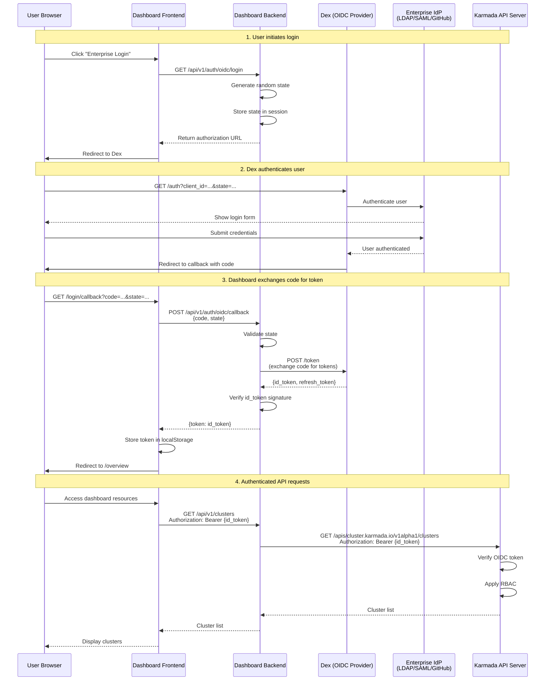
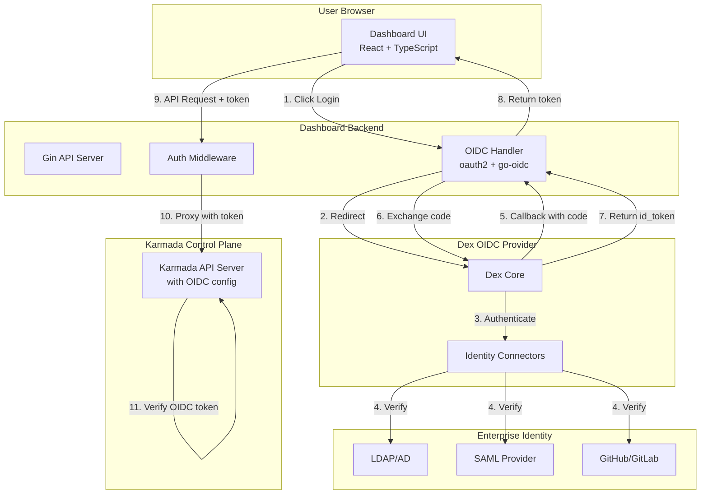
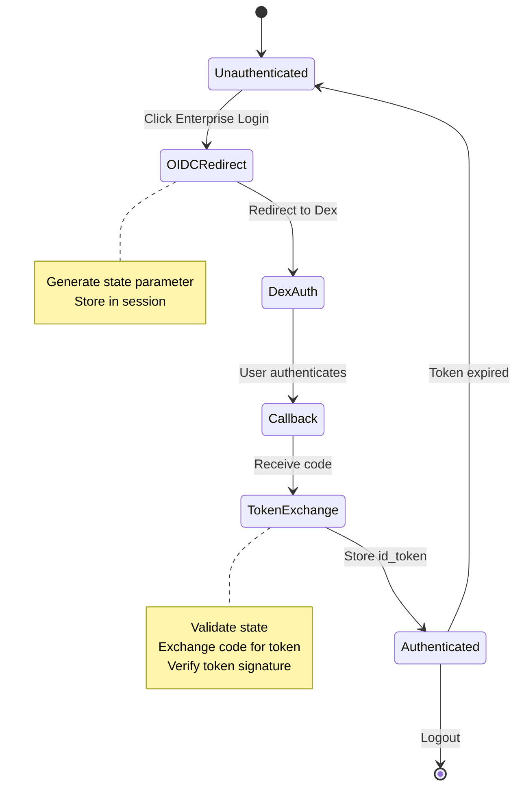

# OIDC Authorization Code Flow Diagram

## Sequence Diagram

```mermaid
sequenceDiagram
    participant User as User Browser
    participant Frontend as Dashboard Frontend
    participant Backend as Dashboard Backend
    participant Dex as Dex (OIDC Provider)
    participant IdP as Enterprise IdP<br/>(LDAP/SAML/GitHub)
    participant Karmada as Karmada API Server

    Note over User,Karmada: 1. User initiates login
    User->>Frontend: Click "Enterprise Login"
    Frontend->>Backend: GET /api/v1/auth/oidc/login
    Backend->>Backend: Generate random state
    Backend->>Backend: Store state in session
    Backend-->>Frontend: Return authorization URL
    Frontend->>User: Redirect to Dex

    Note over User,Karmada: 2. Dex authenticates user
    User->>Dex: GET /auth?client_id=...&state=...
    Dex->>IdP: Authenticate user
    IdP-->>User: Show login form
    User->>IdP: Submit credentials
    IdP-->>Dex: User authenticated
    Dex->>User: Redirect to callback with code

    Note over User,Karmada: 3. Dashboard exchanges code for token
    User->>Frontend: GET /login/callback?code=...&state=...
    Frontend->>Backend: POST /api/v1/auth/oidc/callback<br/>{code, state}
    Backend->>Backend: Validate state
    Backend->>Dex: POST /token<br/>(exchange code for tokens)
    Dex-->>Backend: {id_token, refresh_token}
    Backend->>Backend: Verify id_token signature
    Backend-->>Frontend: {token: id_token}
    Frontend->>Frontend: Store token in localStorage
    Frontend->>User: Redirect to /overview

    Note over User,Karmada: 4. Authenticated API requests
    User->>Frontend: Access dashboard resources
    Frontend->>Backend: GET /api/v1/clusters<br/>Authorization: Bearer {id_token}
    Backend->>Karmada: GET /apis/cluster.karmada.io/v1alpha1/clusters<br/>Authorization: Bearer {id_token}
    Karmada->>Karmada: Verify OIDC token
    Karmada->>Karmada: Apply RBAC
    Karmada-->>Backend: Cluster list
    Backend-->>Frontend: Cluster list
    Frontend-->>User: Display clusters
```

## Component Architecture

```mermaid
graph TB
    subgraph "User Browser"
        UI[Dashboard UI<br/>React + TypeScript]
    end

    subgraph "Dashboard Backend"
        API[Gin API Server]
        OIDC[OIDC Handler<br/>oauth2 + go-oidc]
        Auth[Auth Middleware]
    end

    subgraph "Dex OIDC Provider"
        DexCore[Dex Core]
        Connectors[Identity Connectors]
    end

    subgraph "Enterprise Identity"
        LDAP[LDAP/AD]
        SAML[SAML Provider]
        GitHub[GitHub/GitLab]
    end

    subgraph "Karmada Control Plane"
        KarmadaAPI[Karmada API Server<br/>with OIDC config]
    end

    UI -->|1. Click Login| OIDC
    OIDC -->|2. Redirect| DexCore
    DexCore -->|3. Authenticate| Connectors
    Connectors -->|4. Verify| LDAP
    Connectors -->|4. Verify| SAML
    Connectors -->|4. Verify| GitHub
    DexCore -->|5. Callback with code| OIDC
    OIDC -->|6. Exchange code| DexCore
    DexCore -->|7. Return id_token| OIDC
    OIDC -->|8. Return token| UI
    UI -->|9. API Request + token| Auth
    Auth -->|10. Proxy with token| KarmadaAPI
    KarmadaAPI -->|11. Verify OIDC token| KarmadaAPI
```

## State Management

```mermaid
stateDiagram-v2
    [*] --> Unauthenticated
    Unauthenticated --> OIDCRedirect: Click Enterprise Login
    OIDCRedirect --> DexAuth: Redirect to Dex
    DexAuth --> Callback: User authenticates
    Callback --> TokenExchange: Receive code
    TokenExchange --> Authenticated: Store id_token
    Authenticated --> [*]: Logout
    Authenticated --> Unauthenticated: Token expired

    note right of OIDCRedirect
        Generate state parameter
        Store in session
    end note

    note right of TokenExchange
        Validate state
        Exchange code for token
        Verify token signature
    end note
```
