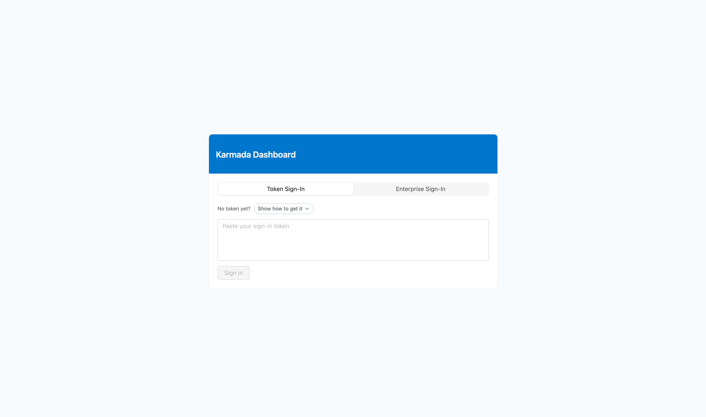
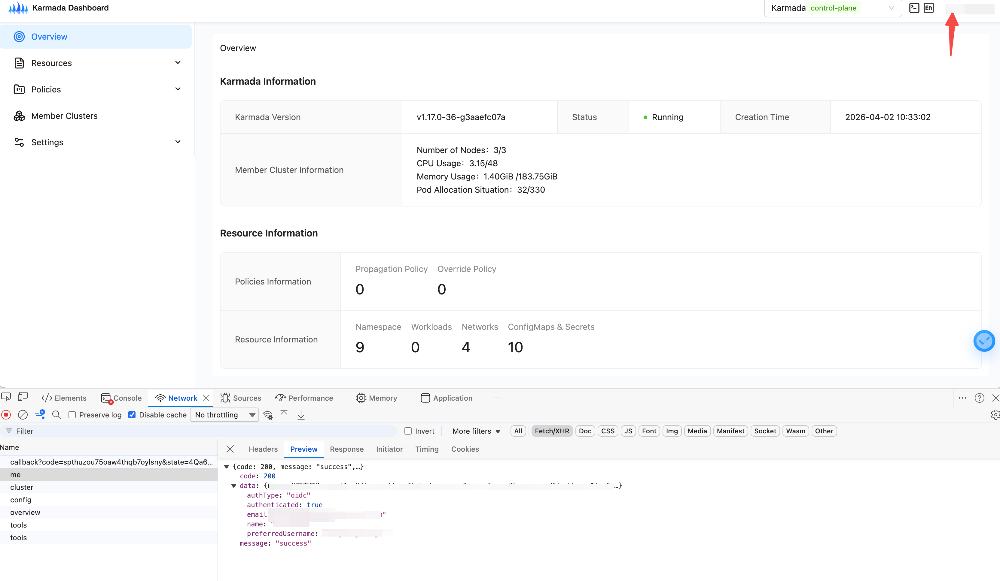

| title | authors | reviewers | approvers | creation-date |
| --- | --- | --- | --- | --- |
| Dex OIDC Integration for Karmada Dashboard | @warjiang | @ | @ | 2026-04-12 |


## Summary

Karmada Dashboard currently supports only a basic Bearer token login model. Users must manually obtain and paste a JWT (typically a Kubernetes ServiceAccount token) to sign in. This approach does not fit enterprise environments, where integration with an existing identity system is usually required.

Dex is a federated OpenID Connect (OIDC) identity provider (IdP). It acts as a unified entry point to upstream identity providers and issues OIDC ID tokens on their behalf. This allows applications to integrate with different enterprise identity systems through one standardized interface.

This proposal describes integrating Dex as the OIDC provider for Karmada Dashboard, so enterprise users can log in with existing organizational accounts via the standard OAuth 2.0 authorization code flow.

## Motivation

The current token-based model has several limitations in enterprise environments:

- **Manual token handling**: Users must generate, copy, and paste ServiceAccount tokens manually, which is error-prone and creates friction.
- **No enterprise IdP integration**: It cannot authenticate users through LDAP, Active Directory, or other enterprise identity systems.
- **No SSO support**: Users cannot reuse existing single sign-on infrastructure.
- **Short-lived tokens**: Kubernetes ServiceAccount tokens expire, forcing users to repeat manual steps.
- **Weak identity mapping**: Dashboard sessions are not naturally tied to real organizational identities, which hurts auditability and RBAC governance.

## Goals

- Use Dex as the OIDC provider and implement the standard OAuth 2.0 authorization code flow.
- Allow users to sign in to Karmada Dashboard with enterprise accounts via Dex.
- Keep backward compatibility: the existing token-based login flow must remain available.

## Non-Goals

- Building a custom identity provider.
- Implementing refresh token rotation or silent token renewal in this phase.

## Proposal

### User Stories

### Story 1

As a platform engineer in an enterprise, I want Karmada Dashboard to support direct enterprise-account login, so users do not need to manually manage Kubernetes ServiceAccount tokens.

Today, onboarding a new team member requires:

1. Creating a Kubernetes ServiceAccount.
2. Binding the correct RBAC roles.
3. Exporting the token and distributing it securely.
4. Asking the user to paste the token into Dashboard.

After integrating Dex OIDC, the process becomes:

1. Configure Dex to connect to the enterprise identity source.
2. Bind permissions to enterprise identities.
3. Let users sign in with enterprise credentials.

### Story 2

As an organizational administrator, I need all infrastructure management tools to authenticate through a centralized IdP, so we can enforce unified audit trails, MFA policies, and immediate offboarding access revocation.

The current token-based approach bypasses the IdP completely. With Dex OIDC integration, all Karmada Dashboard logins go through the IdP, enabling:

- Centralized auditing of who accessed Karmada Dashboard and when.
- Mandatory MFA enforcement based on IdP policy.
- Immediate access revocation by disabling users in the IdP.

### Notes / Constraints / Caveats

- **Dex deployment prerequisites**: Dex must be deployed in advance, and it must be reachable by both Dashboard backend (for token exchange) and end-user browsers (for authorization redirects).
- **HTTPS is required**.
- **State parameter**: The authorization code flow must use a random `state` value to prevent CSRF attacks.
- **API server configuration**: Both Karmada API server and member-cluster Kubernetes API servers must be configured with OIDC settings such as `--oidc-issuer-url` and `--oidc-client-id`.

### Risks and Mitigations

- **Risk**: If Dex is unavailable, login is interrupted.
- **Risk**: Tokens may expire during an active session.

## Design Details

1. When OIDC is enabled, the login page displays the Enterprise Login option：

   

2. Feishu authorization：

   

3. after successful authorization they are redirected into the dashboard, where they can see the currently signed-in user information and a Log out button.

   


### Sequence Diagrams

- **Control plane flow**: Browser -> Dashboard Backend -> Dex -> Karmada API Server.

    ```
    Browser          Dashboard Backend          Dex              Karmada API Server
       │                     │                   │                      │
       │─── GET /login ─────►│                   │                      │
       │◄── Login Page ──────│                   │                      │
       │                     │                   │                      │
       │─ Click Enterprise ─►│                   │                      │
       │  Login button       │                   │                      │
       │                     │                   │                      │
       │◄── { loginURL } ────│                   │                      │
       │                     │                   │                      │
       │─── Redirect ─────────────────────────►  │                      │
       │                     │                   │                      │
       │                     │         User authenticates with IdP      │
       │                     │                   │                      │
       │◄── Redirect to /login/callback ─────────│                      │
       │    ?code=xxx&state=yyy                  │                      │
       │                     │                   │                      │
       │─── GET /api/v1/auth/oidc/callback ─────►│                      │
       │    ?code=xxx&state=yyy                  │                      │
       │                     │                   │                      │
       │                     │─── Exchange code ►│                      │
       │                     │◄── id_token ──────│                      │
       │                     │                   │                      │
       │                     │  Verify id_token  │                      │
       │                     │  against JWKS     │                      │
       │                     │                   │                      │
       │◄── { token: id_token } ──────────────-──│                      │
       │                     │                   │                      │
       │  Store token in localStorage            │                      │
       │                     │                   │                      │
       │─── GET /api/v1/... Bearer id_token ────►│──── Validate OIDC ──►│
       │                     │                   │     token            │
       │◄─────────────────── Response ───────────────────────────────── │
    ```

- **Member cluster flow**: Browser -> dashboard-web (`/clusterapi`) -> kubernetes-dashboard-api -> Karmada cluster proxy -> member cluster API server.

    ```
    Browser          Dashboard Web(8000)     K8s Dashboard API(8002)   Karmada API Server               Member Cluster API
       │                     │                          │                        │                                 │
       │── GET /clusterapi/member1/api/v1/namespace ──► │                        │                                 │
       │   Authorization: Bearer id_token               │                        │                                 │ 
       │                     │── +X-Member-ClusterName=member1 ────────────────► │                                 │
       │                     │                          │── build rest.Config(token)                               │
       │                     │                          │── GET /api/v1/namespace ───────────────────────────────► │
       │                     │                          │                        │── /apis/cluster.../proxy/... ─► |
       │                     │                          │                        │                                 │ RBAC check oidc:<sub>
       │                     │                          │                        │◄──────────────────────────────  │ 200 / 403
       │                     │                          │◄───────────────────────│                                 │
       │                     │◄─────────────────────────│                        │                                 │
       │◄────────────────────│                          │                        │                                 │
    ```


## Test Plan

### Integration Tests

- **OIDCCallbackPage**: verify that the callback page correctly extracts the token from backend response and stores it.
- **LoginPage**: verify that the **Enterprise Login** button is rendered only when OIDC is enabled, and redirects to the expected URL when clicked.